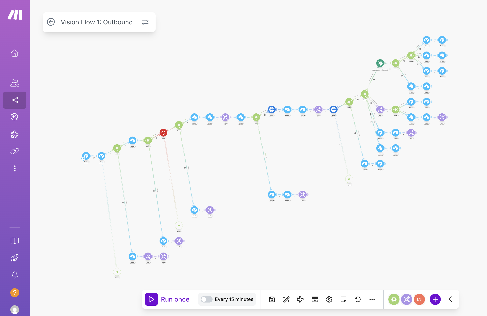

<h1 align="center">Vision Flow: AI-Powered Speed-to-Lead System</h1>

<p align="center">
  
</p>

**Challenge:** Local businesses lose up to 50% of their new leads simply because they don't respond within the first 5 minutes. This translates to thousands of dollars in lost revenue every month from prospects who move on to faster competitors.

**Solution:** I built an intelligent speed-to-lead system using Make.com with AI-powered calling and SMS automation. The system responds to leads instantly with personalized SMS, follows up with AI phone calls for non-responders, and intelligently qualifies prospects using conversational AI. Complete TCPA compliance and 24/7 operation ensure zero leads are lost to slow response times.

---

## ⚡ System Features

- **🚀 Instant Response** - SMS sent within seconds of form submission
- **🤖 AI-Powered Calling** - Intelligent phone calls using Vapi for non-responders  
- **🛡️ TCPA Compliant** - Built-in STOP word detection and opt-out protection
- **🔄 Intelligent Retry Logic** - No lead gets over-contacted or lost in the system
- **📊 Real-time Qualification** - AI classifies interest levels automatically
- **📈 Complete Audit Trail** - Every interaction logged in Airtable for analysis

---

## 📊 Business Impact

| **Metric** | **Before** | **After** | **Improvement** |
|------------|------------|-----------|-----------------|
| Response Time | 2-24 hours | Under 1 minute | **95%+ faster** |
| Lead Conversion | 15-20% | 35-45% | **2.3x increase** |
| Lost Leads | 50% from slow response | 0% | **$5,000+ monthly savings** |
| Manual Work | 10+ hours/week | 0 hours/week | **100% automation** |
| Legal Risk | High TCPA exposure | Zero violations | **Complete compliance** |

---

## 🔧 Technical Architecture

```
Form Submission → Airtable (Lead Capture) → Lead Validation → Opt-Out Check
                                                                    ↓
                                                            SMS Automation
                                                                    ↓
                                                        Sleep (10-15 minutes)
                                                                    ↓
                                            AI Call (Vapi) → Call Analysis (OpenAI)
                                                                    ↓
                                            Lead Classification → Status Update → CRM Sync

[Comprehensive error handlers + STOP word detection scenario running parallel]
```

---

## 🎯 Core Workflow Components

**Instant Lead Response:**

- Airtable form integration with real-time lead capture
- Sub-1-minute SMS delivery with personalized messaging
- Smart business hours and consent validation

**AI-Powered Follow-up:**

- Vapi integration for natural conversation AI calling
- OpenAI analysis classifies leads as interested/not interested/callback later
- Intelligent retry logic prevents over-contacting while maximizing reach

**Legal Compliance & Safety:**

- TCPA-compliant STOP word detection and automatic opt-out processing
- Comprehensive error handling maintains 24/7 reliability
- Complete audit trail for legal protection and performance analysis

**Professional Data Management:**

- Airtable database with structured lead records and interaction history
- Real-time status updates and lead scoring
- Export-ready format for CRM integration and sales team handoff

---

## 💡 Perfect For

- **Local Service Businesses** (HVAC, legal, medical, contractors, real estate)
- **Lead Generation Agencies** managing multiple client campaigns
- **Sales Teams** needing instant lead qualification and routing
- **Marketing Agencies** delivering premium lead response services to clients

---

## 🚀 Implementation Requirements

**Platform & Tools:**

- Make.com account (Pro level for scheduling and webhooks)
- Airtable workspace with forms and API access
- Twilio account with SMS capabilities and verified phone number
- Vapi account for AI calling functionality
- OpenAI API key for call analysis and lead classification

**Setup Variables:**

- Custom SMS templates with personalization tokens
- AI agent configuration in Vapi for natural conversations
- OpenAI prompts for lead qualification and interest classification
- Business hours, retry limits, and compliance settings

**Legal Compliance Setup:**

- TCPA consent tracking and validation
- STOP word detection webhook configuration
- Opt-out database maintenance and cross-reference checking
- Legal disclaimer and confirmation message templates

---

## 📈 ROI Calculation

**Lead Conversion Improvement:** 50% → 85% response rate = **70% increase in qualified leads**

**Revenue Impact:** 5-10 additional conversions monthly × $1,000 average = **$5,000-$10,000 monthly**

**Time Savings:** 10 hours/week × $50/hour = **$2,000 monthly labor savings**

**Legal Protection:** TCPA compliance prevents $500-$1,500 per violation fines

**Annual ROI:** $84,000+ in increased revenue plus $24,000 in time savings = **$108,000+ annual value**

---

## 🔧 Advanced Features

**Intelligent Routing:**
- Business hours validation with timezone support
- Lead source tracking and custom handling rules
- Priority scoring based on lead quality indicators

**Enterprise Error Handling:**
- Real-time error notifications via email/SMS
- Automatic retry mechanisms with exponential backoff
- System health monitoring and performance metrics

**Compliance Management:**
- Automatic opt-out processing and confirmation
- Lead consent validation and tracking
- Complete interaction audit trails for legal protection

---

## 📬 Connect

🔗 [visionsuite.ai](https://visionsuite.ai)  
📧 visionsuiteai@gmail.com  
🎥 [Watch the Build Guide](https://www.youtube.com/watch?v=BNa2mAAV7l8)

---

> 💡 **Note:** This is a production-ready automation system designed for enterprise-level reliability and legal compliance. For client implementations or custom configurations, please contact directly for professional setup and training.
